# Will-a-Customer-Accept-the-Coupon

[View Google Slide Deck](https://docs.google.com/presentation/d/1am5DTK6fpqo4q3DVMYToR2BRiu1ARulltvmFQzL7ahI/edit?usp=sharing)

[Jupiter Notebook](https://github.com/vijayarulmuthu/Will-a-Customer-Accept-the-Coupon/blob/main/notebook/practical-application-1.ipynb)

## Introduction

+ The business problem is to predict the likelihood of a customer accepting a coupon for various restaurants, bars, and coffee shops when it is delivered to their phone while driving.
+ Accepting the coupon can lead to a detour to the restaurant, use it on a subsequent trip, or ignore it.
+ Understanding the factors that affect coupon acceptance can help target the right customers, customize offers, and improve the effectiveness of future marketing campaigns.

## Key Business Questions

+ What customer demographics, such as age, gender, marital status, income, etc., are more likely to accept or reject a coupon?
+ How do contextual factors like weather, time of day, destination, and passenger presence influence coupon acceptance?
+ Are there differences in coupon acceptance rates for different types of businesses, such as restaurants, bars, coffee houses, etc.?
+ Does the time remaining before the coupon expires affect the acceptance rate?

## Coupon Type Distribution

  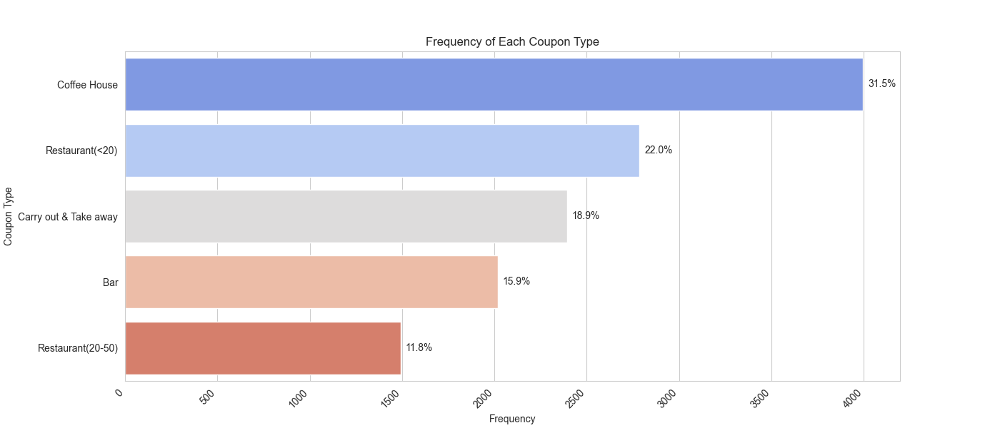

The graph represents the frequency of each coupon type distributed, with a percentage value that indicates the proportion of each kind in the overall distribution:

+ **Coffee House Coupons (31.5%)**: These are the most frequently distributed coupons, making up nearly one-third of all coupons. This suggests that coffee houses might be a popular venue for the customer base or that there's a strategic emphasis on promoting coffee house visits.
+ **Restaurant Coupons (<$20) (22.0%)**: Coupons for less expensive restaurants are the second most common. This could indicate a focus on appealing to price-sensitive customers or promoting more casual dining experiences.
+ **Carry Out & Take Away Coupons (18.9%)**: These represent a sizeable portion of the coupons. The convenience of these services may be particularly appealing to the target audience or represent a growing trend in food consumption.
+ **Bar Coupons (15.9%)**: These are less common than the above types. It could suggest a more niche market for bar visits or that bars are less frequent partners in coupon programs.
+ **Restaurant Coupons ($20-$50) (11.8%)**: The least common are coupons for more expensive dining experiences. This might reflect a higher cost to the business for such offers, a less frequent dining occasion, or a more targeted customer base for these types of restaurants.

## Coupon Overall Acceptance Rate

  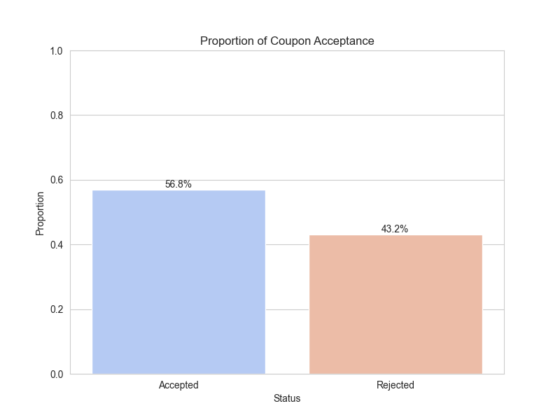

The graph presents the proportion of coupons that have been accepted versus those that have been rejected.

+ A little more than half of the coupons issued are accepted (56.8%), while a significant proportion, nearly half, are rejected (43.2%).
+ The acceptance rate being greater than the rejection rate suggests that the coupons are fairly well-received. Still, the rejection rate is large enough to warrant a closer look at optimizing the offers or targeting strategy.
+ Since almost 43% of the coupons are not used, there may be an opportunity to better understand the drivers who have rejected them. This could involve looking at the type of coupons being rejected and the circumstances under which they were rejected.

## Acceptance Rate by Coupon Types

  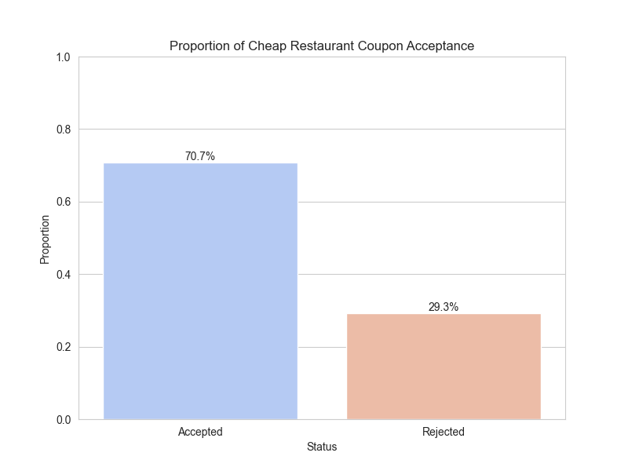
  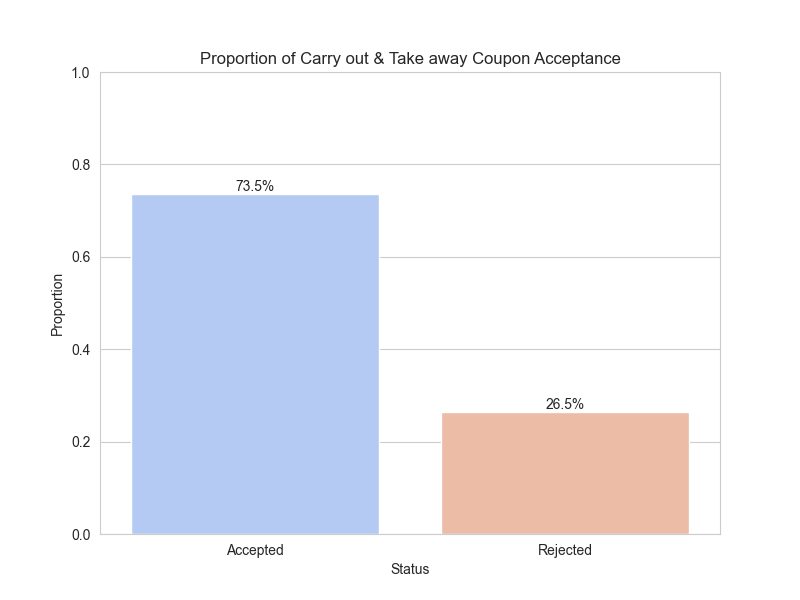
  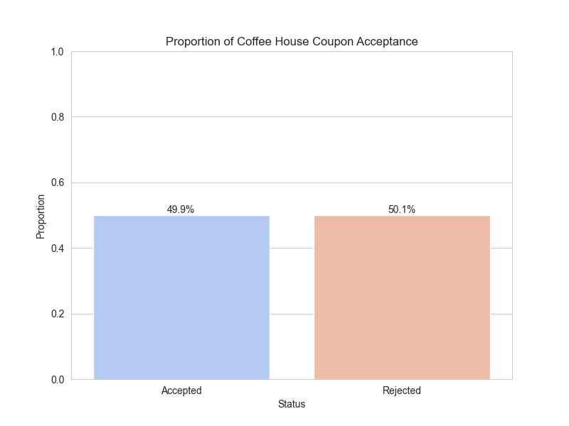
  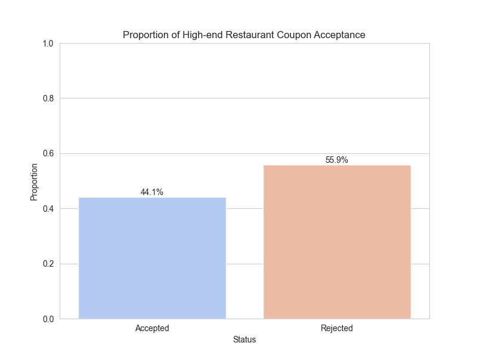
  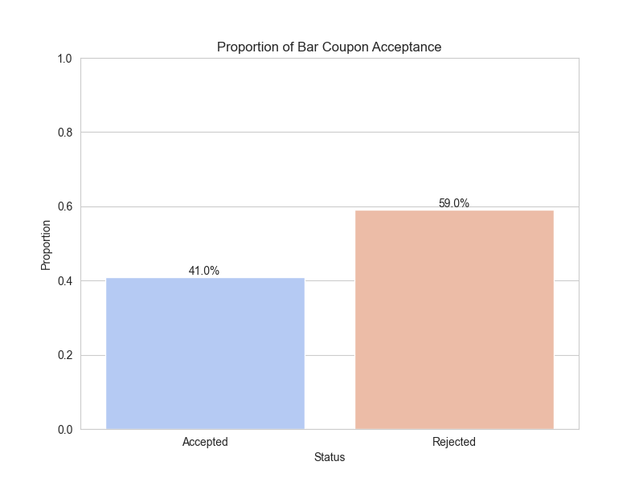

+ The acceptance rate for bar coupons is 41%, while the rejection rate is 59%. This suggests that a majority of recipients are not inclined to use coupons for bars, which could be due to a variety of factors such as personal preferences, the social nature of bars which might not align with the promotion, or other external factors like time of day or demographic suitability.
+ Carry out & take away coupons have a high acceptance rate of 73.5%, indicating that recipients find these coupons appealing and are likely to use them. The convenience factor of these services might contribute to the higher acceptance rate.
+ Coupons for less expensive restaurants have a 70.7% acceptance rate, which is quite substantial, showing that cost-effective dining options are popular among the coupon recipients.
+ Coffee house coupons show nearly equal acceptance and rejection rates, with 49.9% accepted and 50.1% rejected. This almost even split suggests that the decision to use coffee house coupons may be influenced by individual customer habits or the presence of alternative choices.
+ Coupons for high-end restaurants have a lower acceptance rate of 44.1% compared to a rejection rate of 55.9%. The higher cost associated with these restaurants might be a barrier for coupon usage.

## Target Group
The passengers in the car are Friends, the driver is not headed to an urgent destination, the weather is sunny, and the coupon expires in 24 hours.

*Note: We arrive at the target group by reviewing the correlation matrix between the features using the heatmap [(refer notebook)](https://github.com/vijayarulmuthu/Will-a-Customer-Accept-the-Coupon/blob/main/notebook/practical-application-1.ipynb#feature-correlation).*

## Analysis based on the Target Group

  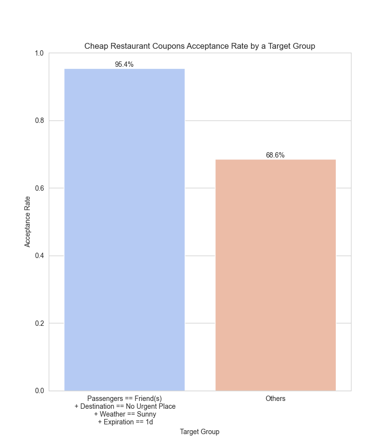
  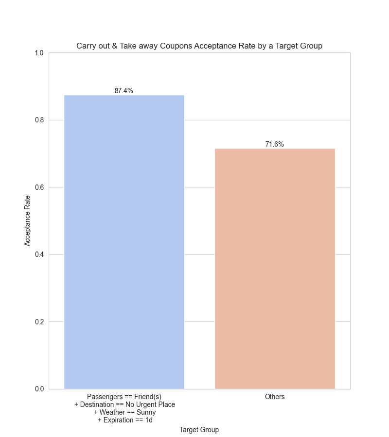
  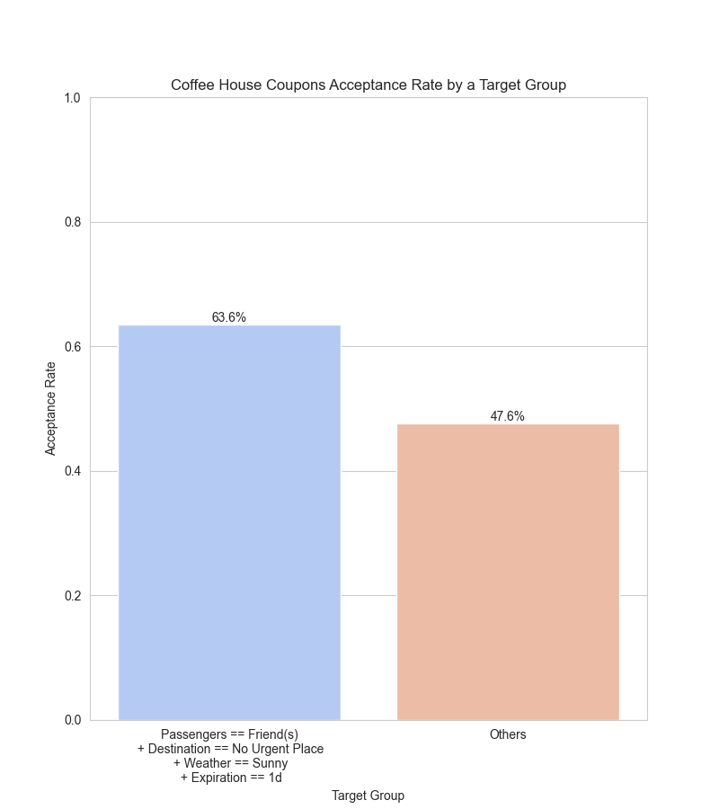
  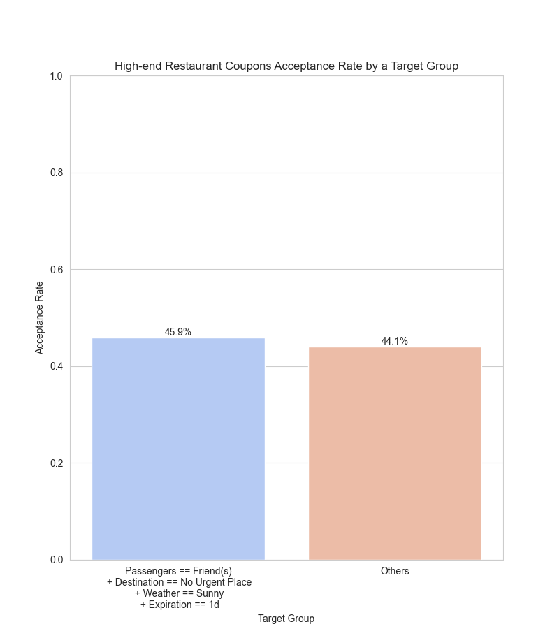
  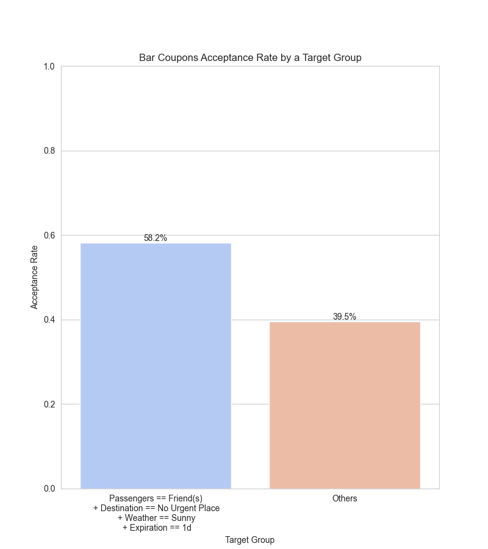

+ The target group, defined by the presence of friends, no urgent destination, sunny weather, and a one-day coupon expiration, has a significantly higher acceptance rate for bar coupons at 58.2% compared to 39.5% for others. This suggests that social context and favorable conditions greatly influence the acceptance of bar-related offers.
+ For carryout and takeaway coupons, the target group shows an even more pronounced preference, with an 87.4% acceptance rate, while others accept these coupons 71.6% of the time. The convenience of these services likely resonates well with customers, especially in a social setting with friends.
+ The target group overwhelmingly accepts cheap restaurant coupons at a rate of 95.4%, much higher than the 68.6% acceptance rate among others. The combination of lower cost and the specified conditions seems particularly appealing, suggesting price sensitivity among this group.
+ The target group's acceptance rate of coffee house coupons is nearly even, with 49.9% acceptance and 50.1% rejection. This is interesting because it starkly contrasts the other types of coupons, indicating that factors such as the type of venue or personal preferences for coffee may influence the decision more than the social or environmental context.
+ For high-end restaurant coupons, the acceptance rate is slightly higher in the target group at 45.9% compared to 44.1% for others. The smaller difference between the groups suggests that the higher cost associated with these restaurants is a significant factor for all customers, regardless of the context.

## Conclusion

+ The data shows that the target group defined by the given conditions is more inclined to accept coupons across all types, particularly for cheap restaurants and carryout & takeaway options.
+ Social outings with friends and favorable weather conditions strongly predict coupon acceptance, especially for leisure-oriented venues like bars and restaurants.
+ High-end restaurant coupons have the least difference in acceptance rates between the target group and others, suggesting that the higher price point of these venues may be a barrier.
+ Marketers could use these insights to tailor their promotional strategies, capitalizing on social and environmental factors that increase the likelihood of coupon acceptance.
+ There could be opportunities to increase acceptance rates among other segments by exploring additional factors incentivizing higher coupon usage.

## Next Steps and Recommendations

Following the CRISP-DM (Cross-Industry Standard Process for Data Mining) framework, after analyzing the coupon acceptance data using the Business Understanding, Data Understanding, and Data Preparation phases of the process, the following are the next steps:

### Modeling
+ Develop predictive models to identify the likelihood of coupon acceptance based on the identified features.
+ Compare different modeling techniques (like logistic regression, decision trees, or ensemble methods) to find the most accurate model for predicting coupon acceptance.

### Evaluation
+ Evaluate the models using appropriate metrics, such as accuracy, precision, recall, or the AUC-ROC curve.
+ Perform a cost-benefit analysis to understand the trade-offs between implementing new marketing strategies versus expected gains from increased coupon redemptions.

### Deployment
+ Develop a strategy for deploying the model into a production environment where it can inform real-time marketing decisions.
+ Establish a monitoring system to track the deployed model's performance and capture feedback for continuous improvement.
